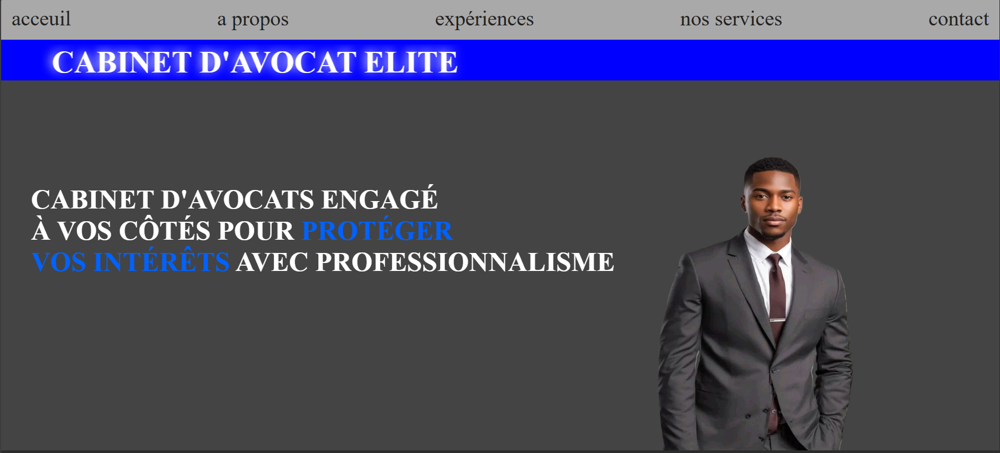

# ⚖️ PROJET CABINET AVOCAT

Un site web moderne et responsive développé pour présenter un cabinet d'avocats. Ce projet met en avant les services juridiques, les profils des avocats et facilite la prise de contact avec les clients.

---

## 📖 Description

Le site a été réalisé dans le but de fournir une présence professionnelle en ligne à un cabinet d'avocats. Il permet aux visiteurs de découvrir les domaines d'expertise du cabinet, les membres de l'équipe, les honoraires proposés et de contacter facilement le cabinet.

Le projet a été développé avec des technologies web de base en mettant l'accent sur une interface claire, élégante et adaptée à tous les types d'écrans.

---

## ✨ Fonctionnalités

- 🏠 Page d'accueil
- 📖 À propos du cabinet
- 👨‍⚖️ Profil des avocats
- ⚖️ Services juridiques
- ❓ Foire Aux Questions (FAQ)
- 💰 Tableau des honoraires
- 📞 Formulaire de contact
- 📱 Interface responsive (ordinateur, tablette et mobile)

---

## 🛠️ Technologies utilisées

- HTML5
- CSS3
- Git
- GitHub
- Vercel (Déploiement)

---

## 📂 Structure du projet

```
PROJET_CABINET_AVOCAT/
│
├── css/
│   └── style.css
│
├── images/
│
├── index.html
│
├── README.md
│
└── .gitignore
```

---

## 🚀 Installation

1. Clonez le dépôt :

```bash
git clone https://github.com/jeanbaptistejosue512-netizen/Projet_Cabinet_Avocat
```

2. Accédez au dossier du projet :

```bash
cd PROJET_CABINET_AVOCAT
```

3. Ouvrez le fichier **index.html** dans votre navigateur.

---

## 🌐 Démonstration

Le projet est déployé sur **Vercel**.

🔗 **Lien du site :**
https://projet-cabinet-avocat-two.vercel.app/

---

## 📱 Compatibilité

Le site fonctionne correctement sur :

- Google Chrome
- Microsoft Edge
- Mozilla Firefox
- Opera
- Safari

---

## 📸 Aperçu

```
Images/
   
   
   
```

---

## 👥 Auteurs

Ce projet a été réalisé par :

- **Josué JEAN-BAPTISTE**
- **Don Naël DEROSIER**
- **Shadrac Ives Farley CHARLES**
- **Alexendia JULIEN**
- **Vernadin John MARDY**


Étudiant en Sciences Informatiques

GitHub :
https://github.com/jeanbaptistejosue512-netizen/Projet_Cabinet_Avocat

---

## 📄 Licence

Ce projet est réalisé dans un but pédagogique et de démonstration.